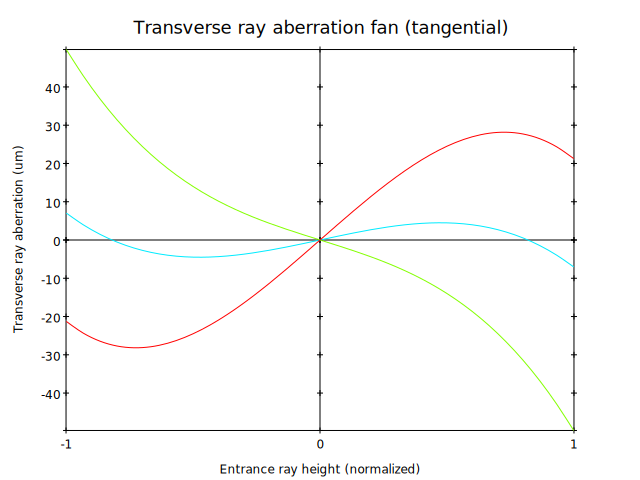
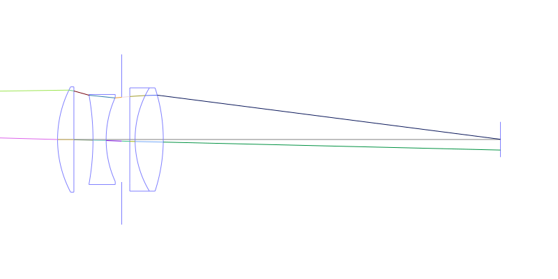
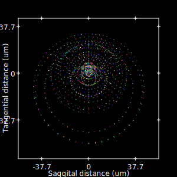
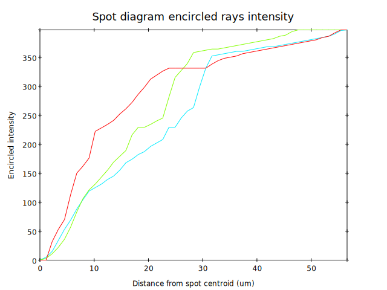
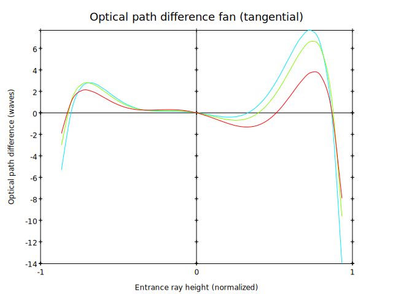
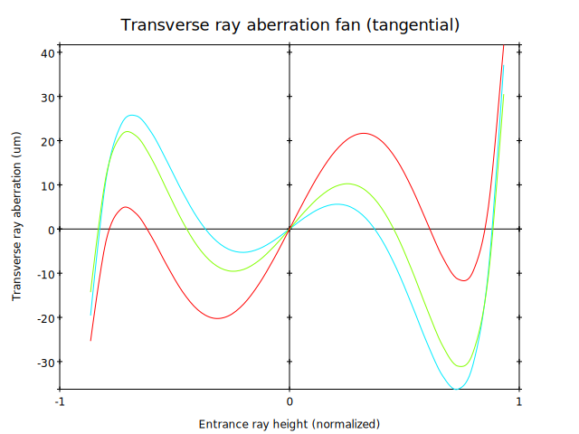
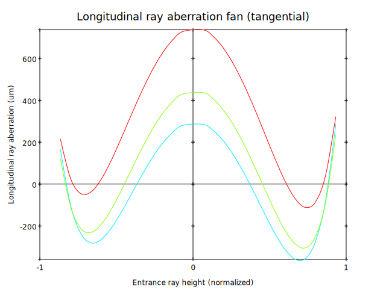
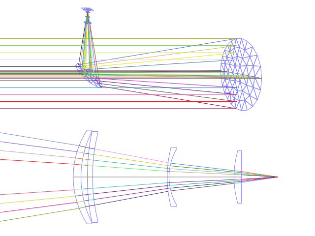
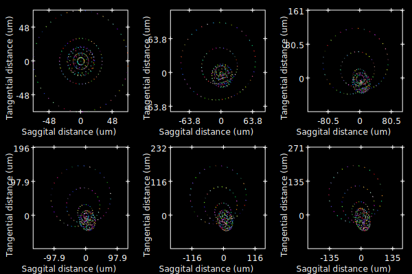

This manual is for GNU Optical.  Copyright (C) 2010-2011 Free Software
Foundation, Inc.

::

     Copyright (C) 2010-2011 Free Software Foundation, Inc. Permission
     is granted to copy, distribute and/or modify this document under
     the terms of the GNU Free Documentation License, Version 1.3 or
     any later version published by the Free Software Foundation; with
     no Invariant Sections, no Front-Cover Texts, and no Back-Cover
     Texts. A copy of the license is included in the section entitled
     "GNU Free Documentation License".

     Author: Alexandre Becoulet

1 Introduction
**************

GNU Optical is a C++ optical design and simulation library. It is
free software and this implementation is based on the version
that is part of the GNU project .

It provides model classes for optical components, surfaces and
materials. It enables building optical systems by creating and placing
various optical components in a 3d space and simulates light
propagation through the system. Classical optical design analysis tools
can be used on optical systems.

It takes advantages of the C++ object model to allow building
complex optical systems with a few classes instanciations as optical
components are represented by language objects.

1.1 Features list
=================

* GNU Optical relies on an object oriented optical design approach.
  This allows designing optical component models and reuse them
  nested in other designs. Components are stored in herarchical form
  and live in a three-dimentional space with group (*note
  sys_Group_class_reference::) local coordinates.

* Support for sequential and non-sequential ray-tracing.

* Available components include:

  * Single optical surfaces

  * Lenses

  * mirrors

  * Point sources and

  * image planes.

Surface curve and material used by optical components are
described using dedicated models.

* Several surface curvature models are available:

  * Conic curves.

  * Polynomial curves.

  * rotationally symmetric splines and Grid splines.

  * Zernike polynomials .

  * Foucault test curves.

  * Composition of other curve models.

  * Array of other curve models.

  * User defined curve models.

Most curve models can be described using model specific parameters
or by best fitting any curve object.

* Several glass material models are available:

  * Interpolated dispersion glass model

  * Abbe number and mil number model glass model.

  * Sellmeier glass model.

  * Schott glass model.

  * Conrady glass model.

  * Herzberger glass model.

  * A simple reflective surfaces mirror model.

  * A more accurate metal material model.

  * Air and vaccum models.

* Surfaces outline shapes are described by a set of model classes
  too:

  * disk shapes model.

  * Ring shapes model.

  * Ellipse shapes model.

  * Rectangle shapes model.

  * Regular polygon and User defined polygon shapes models.

* Optical system analysis tools include:

  * Layout and rays rendering in 2d and 3d,

  * Best point of focus finding.

  * Various ray fan plots.

  * spot diagram plots.

* Several graphical output driver are available to render optical
  layouts and plots:

  * output in Svg vector format.

  * output in bitmap format using the Gd library. (Unsupported in this version)

  * output in Dxf CAD format. (Unsupported in this version)

  * output in various formats via the PlPlot library. (Unsupported in this version)

  * X11 display on UNIX boxes. (Unsupported)

  * 3d display using the OpenGL library. (Unsupported in this vserion)

  * output in X3D, a standard 3d format. (Unsupported)

* Various optical design file formats can be read:

  * Oslo glass catalog

  * Zemax glass catalog and optical designs

2 Conventions
*************

2.1 Coordinates system
======================

Each optical element in GNU Optical lives in its own coordinates system.
It's usually located at _(0, 0, 0)_ with the _Z_ axis being the local
optical axis.

.. figure:: images/coordinates.png
   :alt: Coordinate System

2.2 Measurement units
=====================

* Lengths are expressed using millimeter unit.

* Wavelengths are expressed in nanometer unit in vacuum.

* Absolute refractive indexes are used, with 1 being the refractive index of vacuum.

2.3 Object references
=====================
This version of GNU Optical requires C++ 14 or above.

C++ objects are used to model optical elements, materials, curvatures,
shapes and other kinds of object GNU Optical deals with. As the optical
system is being built, some objects keep references to other objects.

The C++ smart pointer classes are used to manage objects in a
convenient way. Objects can only be ha=eap allocated as all references
require use of smart pointers.::

    using namespace goptical;

    auto sys = std::make_shared<sys::System>();

    // statically allocated object added to the system
    auto source_rays = std::make_shared<sys::SourceRays>(math::Vector3(0, 27.5, -1000));
    sys.add(source_rays);

3 Tutorial
**********

This section contains some commented example of applications and codes
which use the GNU Optical library to model optical systems.

3.1 A simple refractor design
=============================

3.1.1 Building the optical system
---------------------------------

Unlike much optical design software which relies on a list of surfaces
to sequentially propagate light through the system, GNU Optical uses an
object representation of the optical system in 3d space.

To model an optical system with GNU Optical, we just have to
instantiate components and add them to the system.

For this refractor example we first need to deal with glass
materials used in the design. Our achromatic refractor design needs two
lenses of different glass materials. In this example we choose to model
Bk7 and F3 glasses with the Sellmeier model::

  // code from examples/simple_refractor/refractor.cpp

  auto bk7 = std::make_shared<material::Sellmeier> (1.03961212, 6.00069867e-3,
                                                    0.231792344, 2.00179144e-2,
                                                    1.01046945, 1.03560653e2);

  auto f3 = std::make_shared<material::Sellmeier> (
      8.23583145e-1, 6.41147253e-12, 7.11376975e-1, 3.07327658e-2,
      3.12425113e-2, 4.02094988);

The sys::OpticalSurface
class is used to model a single optical surface.

The two lenses have the same disk outline shape, so we declare the
shape model once::

  /* anchor lens_shape */
  auto lens_shape
      = std::make_shared<shape::Disk> (100); // lens diameter is 100mm

  // 1st lens, left surface
  auto curve1 = std::make_shared<curve::Sphere> (
      2009.753); // spherical curve with given radius of curvature
  auto curve2 = std::make_shared<curve::Sphere> (-976.245);

Surface curves rely on dedicated models which are not dependent on
optical component being used. Here we need two simple spherical curves
for the first lens.

The first lens component can then be instantiated. We need to
specify its 3d position, thickness, shape model, curve models and
material models. material::none will later be replaced
by system environment material.

::

  /* anchor lens1 */
  auto s1 = std::make_shared<sys::OpticalSurface> (
      math::Vector3 (0, 0, 0), // position,
      curve1, lens_shape,      // curve & aperture shape
      material::none, bk7);    // materials

  // 1st lens, right surface
  auto s2 = std::make_shared<sys::OpticalSurface> (
      math::Vector3 (0, 0, 31.336), curve2, lens_shape, bk7, material::none);

More convenient optical surface constructors are available for
simple cases, with circular aperture and spherical curvature. They are
used for the second lens::

  /* anchor lens2 */
  // 2nd lens, left surface
  auto s3 = std::make_shared<sys::OpticalSurface> (
      math::Vector3 (0, 0, 37.765), // position,
      -985.291, 100,                // roc & circular aperture radius,
      material::none, f3);          // materials

  // 2nd lens, right surface
  auto s4 = std::make_shared<sys::OpticalSurface> (
      math::Vector3 (0, 0, 37.765 + 25.109), -3636.839, 100, f3,
      material::none);

The sys::Lens class is more
convenient to use for most designs as it can handle a list of surfaces.
In this example we choose to use the sys::OpticalSurface (*note
sys_OpticalSurface_class_reference::) class directly to show how things
work. The convenient method is used in the next example.

We then create a point light source at infinite distance with a
direction vector aimed at entry surface (left of first lens)::

  // light source
  auto source = std::make_shared<sys::SourcePoint> (sys::SourceAtInfinity,
                                                    math::Vector3 (0, 0, 1));

And we finally create an image plane near the expected focal point::

  // image plane
  auto image
      = std::make_shared<sys::Image> (math::Vector3 (0, 0, 3014.5), // position
                                      60); // square size,

All these components need to be added to an optical system::

  auto sys = std::make_shared<sys::System> ();

  // add components
  sys->add (source);
  sys->add (s1);
  sys->add (s2);
  sys->add (s3);
  sys->add (s4);
  sys->add (image);

This simple optical design is ready for ray tracing and analysis.

3.1.2 Performing light propagation
----------------------------------

light propagation through the optical system is performed by the
trace::tracer class. There are
several tracer parameters which can be tweaked before starting light
propagation. Some default parameters can be set for an optical system
instance; they will be used for each new tracer created for the system.

When light is propagated through the system, a tracer may be
instructed to keep track of rays hitting or generated by some of the
components for further analysis.

Some analysis classes are
provided which embed a tracer configured for a particular analysis, but
it's still possible to request a light propagation by directly
instantiating a tracer object.

There are two major approaches to trace rays through an optical
system:

* Sequential ray tracing: This requires an ordered list of surfaces
  to traverse. Rays are generated by the light source and propagated
  in the specified sequence order. Any light ray which doesn't reach
  the next surface in order is lost.

* Non-sequential ray tracing: Rays are generated by the light source
  and each ray interacts with the first optical component found on
  its path. Rays are propagated this way across system components
  until they reach an image plane or get lost.

The default behavior in GNU Optical is to perform a non-sequential ray
trace when no sequence is provided.

Non-sequential ray trace
........................

A non-sequential ray trace needs the specification of an entrance pupil
so that rays from light sources can be targeted at optical system entry.

Performing light propagation only needs instantiation of a
trace::tracer object and
invocation of its trace::tracer::trace function. tracer
parameters are inherited from system default tracer parameters::

    sys->set_entrance_pupil (s1);
    trace::Tracer tracer (sys.get ());
    tracer.trace ();

When performing a non-sequential ray trace, only optical components
based on sys::Surface will
interact with light.

All enabled light sources which are part of the system are
considered.

Sequential ray trace
....................

Switching to a sequential ray trace is easy: The sequence is setup from
components found in the system, in order along the Z axis.

::

  /* anchor seq */
  auto seq = std::make_shared<trace::Sequence> (*sys);

  sys->get_tracer_params ().set_sequential_mode (seq);

More complicated sequences must be created empty and described
explicitly using the trace::sequence::add function.

Optical system and sequence objects can be displayed using stl
streams::

   std::cout << "system:" << std::endl << sys;
   std::cout << "sequence:" << std::endl << seq;

Ray tracing is then performed in the same way as for non-sequential
ray traces::

    trace::Tracer tracer (sys.get ());
    tracer.trace ();

When performing a sequential ray trace, all optical components can
process incoming light rays.

A single light source must be present at the beginning of the
sequence.

3.1.3 Rendering optical layout and rays
---------------------------------------

The result of ray tracing is stored in a trace::Result (*note
trace_Result_class_reference::) object which stores information about
generated and intercepted rays and involved components for each ray.
Not all rays' interactions are stored by default, and the result object
must be first configured to specify which interactions should be stored
for further analysis.

Here we want to draw all rays which are traced through the system.
We first have to instruct our trace::Result (*note
trace_Result_class_reference::) object to remember which rays were
generated by the source component in the system, so that it can used as
a starting point for drawing subsequently scattered and reflected rays.

We use an io::Renderer based
object which is able to draw various things. We use it to draw system
components as well as to recursively draw all rays generated by light
sources.

Here is what we need to do in order:

* Instantiate a renderer object able to write graphics in some output format.

* Fit renderer viewport to optical system.

* Draw system components.

* Optionally change the ray distribution on entrance pupil so that only meridional rays are traced.

* Instruct the result object to keep track of rays generated by the source component.

* Perform the ray tracing.

* Draw traced rays.

::

    io::RendererSvg renderer ("layout.svg", 1024, 100);

    // draw 2d system layout
    sys->draw_2d_fit (renderer);
    sys->draw_2d (renderer);

    trace::Tracer tracer (sys.get ());

    // trace and draw rays from source
    tracer.get_params ().set_default_distribution (
        trace::Distribution (trace::MeridionalDist, 5));
    tracer.get_trace_result ().set_generated_save_state (*source);
    tracer.trace ();
    tracer.get_trace_result ().draw_2d (renderer);

3.1.4 Performing a ray fan analysis
-----------------------------------

The analysis  namespace contains
classes to perform some common analysis on optical systems. analysis
classes may embed a trace::tracer (*note
trace_tracer_class_reference::) object if light propagation is needed
to perform analysis.

Ray fan plots can be computed using the analysis::RayFan (*note
analysis_RayFan_class_reference::) class which is able to plot various
ray measurements on both 2d plot axes.

The example below shows how to produce a transverse aberration plot
by plotting entrance ray height against transverse distance::

    /* anchor rayfan */
    io::RendererSvg renderer ("fan.svg", 640, 480, io::rgb_white);

    analysis::RayFan fan (sys);

    // select light source wavelens
    source->clear_spectrum ();
    source->add_spectral_line (light::SpectralLine::C);
    source->add_spectral_line (light::SpectralLine::e);
    source->add_spectral_line (light::SpectralLine::F);

    // get transverse aberration plot
    std::shared_ptr<data::Plot> fan_plot
        = fan.get_plot (analysis::RayFan::EntranceHeight,
                        analysis::RayFan::TransverseDistance);

    fan_plot->draw (renderer);

3.2 A photo lens design
=======================

3.2.1 Using the Lens component
------------------------------

The sys::Lens class is a convenient
way to model a list of optical surfaces. In this example we use it to
model a Tessar photo lens by adding all optical surfaces to the lens
object. Several functions are available to add surfaces to the lens;
one of the simplest can create spherical surfaces with circular
aperture for us. In this example, the glass material models used are
created on the fly::

  // code from examples/tessar_lens/tessar.cpp

  //**********************************************************************
  // Optical system definition

  auto sys = std::make_shared<sys::System>();

  /* anchor lens */
  auto lens = std::make_shared<sys::Lens>(math::Vector3(0, 0, 0));

  //               roc,            ap.radius, thickness,

  lens->add_surface(1/0.031186861,  14.934638, 4.627804137,
                   std::make_shared<material::AbbeVd>(1.607170, 59.5002));

  lens->add_surface(0,              14.934638, 5.417429465);

  lens->add_surface(1/-0.014065441, 12.766446, 3.728230979,
                   std::make_shared<material::AbbeVd>(1.575960, 41.2999));

  lens->add_surface(1/0.034678487,  11.918098, 4.417903733);

  lens->add_stop(12.066273, 2.288913925);

  lens->add_surface(0,              12.372318, 1.499288597,
                   std::make_shared<material::AbbeVd>(1.526480, 51.4000));

  lens->add_surface(1/0.035104369,  14.642815, 7.996205852,
                   std::make_shared<material::AbbeVd>(1.623770, 56.8998));

  lens->add_surface(1/-0.021187519, 14.642815, 85.243965130);

  sys->add(lens);

3.2.2 Adding multiple light sources
-----------------------------------

The sys::source_point class
can be used to create a point light source suitable for analysis, but
we sometimes want to trace custom rays. This can be achieved by using
the sys::SourceRays component class.

In this example we add both source types to our system but enable a
single one at the same time. The sys::SourceRays (*note
sys_SourceRays_class_reference::) is used to draw a 2d layout with
chief and marginal rays whereas the sys::source_point (*note
sys_source_point_class_reference::) source is used with multiple
wavelengths for ray fan and spot diagram analysis::

  /* anchor sources */
  auto source_rays = std::make_shared<sys::SourceRays>(math::Vector3(0, 27.5, -1000));

  auto source_point = std::make_shared<sys::SourcePoint>(sys::SourceAtFiniteDistance,
                                math::Vector3(0, 27.5, -1000));

  // add sources to system
  sys->add(source_rays);
  sys->add(source_point);

  // configure sources
  source_rays->add_chief_rays(*sys);
  source_rays->add_marginal_rays(*sys, 14);

  source_point->clear_spectrum();
  source_point->add_spectral_line(light::SpectralLine::C);
  source_point->add_spectral_line(light::SpectralLine::e);
  source_point->add_spectral_line(light::SpectralLine::F);

The object is located at -1000 on the Z axis and has a height of
27.5.

3.2.3 Plotting spot diagram
---------------------------

The analysis::spot class can be
used to plot spot diagrams::

    sys->enable_single<sys::Source>(*source_point);

    sys->get_tracer_params().set_default_distribution(
      trace::Distribution(trace::HexaPolarDist, 12));

    analysis::Spot spot(sys);

    /* anchor end */
    {
    /* anchor spot */
      io::RendererSvg renderer("spot.svg", 300, 300, io::rgb_black);

      spot.draw_diagram(renderer);
    /* anchor end */
    }

::

    {
    /* anchor spot_plot */
      io::RendererSvg renderer("spot_intensity.svg", 640, 480);

      std::shared_ptr<data::Plot> plot = spot.get_encircled_intensity_plot(50);

      plot->draw(renderer);
    /* anchor end */
    }

3.2.4 Plotting ray fans
-----------------------

Various ray fan plots can be obtained by using the analysis::RayFan
class::

  {
    /* anchor opd_fan */
    sys->enable_single<sys::Source>(*source_point);

    analysis::RayFan fan(sys);

    /* anchor end */
    {
    /* anchor opd_fan */
      io::RendererSvg renderer("opd_fan.svg", 640, 480);

      std::shared_ptr<data::Plot> fan_plot = fan.get_plot(analysis::RayFan::EntranceHeight,
                                              analysis::RayFan::OpticalPathDiff);

      fan_plot->draw(renderer);

    /* anchor end */
    }

::

    {
    /* anchor transverse_fan */
      io::RendererSvg renderer("transverse_fan.svg", 640, 480);

      std::shared_ptr<data::Plot> fan_plot = fan.get_plot(analysis::RayFan::EntranceHeight,
                                              analysis::RayFan::TransverseDistance);

      fan_plot->draw(renderer);

    /* anchor end */
    }

::

    {
    /* anchor longitudinal_fan */
      io::RendererSvg renderer("longitudinal_fan.svg", 640, 480);

      std::shared_ptr<data::Plot> fan_plot = fan.get_plot(analysis::RayFan::EntranceHeight,
                                              analysis::RayFan::LongitudinalDistance);

      fan_plot->draw(renderer);

    /* anchor end */
    }

3.3 system hierarchy and groups
===============================

GNU Optical allows arranging components of the optical system in a
hierarchical manner. Optical component classes all inherit from the
sys::Element class. Elements which inherit from the sys::Group
class can contain nested elements.

Each element has a local coordinate system and stores a
math::Transform<3> object which describes its translation and rotation
relative to the parent coordinate system.

3.3.1 The Lens component
------------------------

The sys::Lens optical component is a
good example of group component. It is based on the sys::Group
class so that it can embed
sys::OpticalSurface  and
sys::Stop  elements.

When displaying the system and ray trace sequence of the tessar lens
design described in the previous section ,
we notice that the system hierarchy has been flattened in the sequence:

::

     system:
        [1]<goptical/core::sys::Lens at [0, 0, 0]
        [10]<goptical/core::sys::image at [0, 0, 125.596]
        [11]<goptical/core::sys::SourceRays at [0, 27.5, -1000]
        [12]<goptical/core::sys::source_point at [0, 27.5, -1000]
     sequence:
        [11]<goptical/core::sys::SourceRays at [0, 27.5, -1000]
        [12]<goptical/core::sys::source_point at [0, 27.5, -1000]
        [2]<goptical/core::sys::OpticalSurface at [0, 0, 0]
        [3]<goptical/core::sys::OpticalSurface at [0, 0, 4.6278]
        [4]<goptical/core::sys::OpticalSurface at [0, 0, 10.0452]
        [5]<goptical/core::sys::OpticalSurface at [0, 0, 13.7735]
        [6]<goptical/core::sys::Stop at [0, 0, 18.1914]
        [7]<goptical/core::sys::OpticalSurface at [0, 0, 20.4803]
        [8]<goptical/core::sys::OpticalSurface at [0, 0, 21.9796]
        [9]<goptical/core::sys::OpticalSurface at [0, 0, 29.9758]
        [10]<goptical/core::sys::image at [0, 0, 125.596]

Positions of optical surfaces are relative to the parent lens
position.

3.3.2 A newton telescope with corrector
---------------------------------------

Object-oriented programming together with the hierarchical optical
components organization in GNU Optical allows writing complex and
dynamically parameterized optical component models composed of simple
components.

Using the telescope model
.........................

Usage of the newton telescope model class (*note
Design_telescope_Newton_class_reference::) is presented here as an
example of parameterized models which contain simple components. The
following example shows how to build an optical design composed of a
light source, the newton telescope model, a corrector lens assembly and
an image plane.

The model constructor is called with the basic newton telescope
parameters and the model internally computes other parameters of the
telescope and instantiates internal optical components as needed.

::

  // code from examples/hierarchical_design/newton.cpp

  /* anchor telescope */
  auto sys = std::make_shared<sys::System> ();

  // light source
  auto source = std::make_shared<sys::SourcePoint> (sys::SourceAtInfinity,
                                                    math::vector3_001);
  sys->add (source);

  // Newton telescope
  auto newton = std::make_shared<Design::telescope::Newton> (
      math::vector3_0, // position
      1494.567 / 2.,   // focal len
      245.1);          // aperture diameter
  sys->add (newton);

We can query the telescope model to get the 3d position of the focal
plane within parent coordinates. This enables us to attach the image
plane or next optical component at right location without much
calculation.

Adding a corrector
..................

We choose to attach a Wynne 4 lens corrector to the telescope. As usual
we describe the corrector lens group using the sys::Lens (*note
sys_Lens_class_reference::) component::

  // Wynne 4 lens corrector for parabolic mirrors
  auto wynne
      = std::make_shared<sys::Lens> (newton->get_focal_plane (),
                                     -48.4585); // z offset of first surface

  //  roc       ap.radius  thickness  material
  wynne->add_surface (21.496, 23.2 / 2., 1.905, bk7);
  wynne->add_surface (24.787, 22.5 / 2., 1.574);
  wynne->add_surface (55.890, 22.5 / 2., 1.270, bk7);
  wynne->add_surface (45.164, 21.8 / 2., 18.504);
  wynne->add_surface (29.410, 14.7 / 2., 0.45, bk7);
  wynne->add_surface (13.870, 14.1 / 2., 16.086);
  wynne->add_surface (23.617, 13.1 / 2., 1.805, bk7);
  wynne->add_surface (0, 12.8 / 2., 9.003);

  sys->add (wynne);

  // image plane
  auto image = std::make_shared<sys::Image> (wynne->get_exit_plane (), 15);
  sys->add (image);

The first surface of the corrector is located relative to origin of
the `wynne' lens component with a Z offset of -48.4585 in the lens
coordinate system but the whole lens is rotated and positioned at the
telescope focal plane in the parent coordinate system.

Finally an image plane is created and positioned according to the
corrector position and last surface thickness.

Querying model and rendering layouts
....................................

The model class may also provide access to some internal construction
details::

  std::cout << "unvignetted image diameter: "
            << newton->get_unvignetted_image_diameter () << std::endl;

  std::cout << "secondary minor axis size: "
            << newton->get_secondary_minor_axis () << std::endl;

  std::cout << "secondary offset: " << newton->get_secondary_offset ()
            << std::endl;

  std::cout << "field angle: " << newton->get_field_angle () << std::endl;

2d and 3d layouts of the whole system or groups can be rendered. The
following code uses paging to render two such different views of the
system::

  {
    trace::Tracer tracer (sys.get ());

    // set system entrance pupil (needed by non-sequential ray trace)
    sys->set_entrance_pupil (newton->get_primary ());

    // trace rays through the system
    tracer.get_params ().set_default_distribution (
        trace::Distribution (trace::CrossDist, 5));
    tracer.get_trace_result ().set_generated_save_state (*source);
    tracer.trace ();

    /* anchor layout */
    io::RendererSvg svg_renderer ("layout.svg", 640, 480);
    io::RendererViewport &renderer = svg_renderer;

    // horizontal page layout
    renderer.set_page_layout (1, 2);

    // 3d system layout on 1st sub-page
    renderer.set_page (0);
    renderer.set_perspective ();

    sys->draw_3d_fit (renderer, 300);
    sys->draw_3d (renderer);

    tracer.get_trace_result ().draw_3d (renderer);

    // 2d Wynne corrector layout on 2nd sub-page
    renderer.set_page (1);

    wynne->draw_2d_fit (renderer);
    wynne->draw_2d (renderer);

    tracer.get_trace_result ().draw_2d (renderer, false, wynne.get ());
    /* anchor end */
  }

3.4 A parameterizable segmented mirror model
============================================

This section shows how to take advantages of the hierarchical design
feature of GNU Optical to write your
own parameterizable optical component models. The code of a segmented
mirror component model is presented and this new component is used as
the primary mirror in a Ritchey-Chretien telescope design.

.. figure:: images/hexseg_mirror.png
   :alt: 3d layout of a Ritchey-Chretien telescope with segmented primary mirror (X3D output)

3.4.1 Writing the component model class
---------------------------------------

The segmented mirror model uses hexagonal segments and takes a surface
curve model, an aperture shape model, segment size and segment
separation as parameters. We start the definition of our model class
which inherits from the sys::Group
class::

    // code from examples/segmented_mirror/segmented.cpp

    class HexSegMirror : public sys::Group
    {
    public:
      HexSegMirror (const math::VectorPair3 &pos,
                    const std::shared_ptr<curve::Base> &curve,
                    const std::shared_ptr<shape::Base> &shape, double seg_radius,
                    double separation)
          : sys::Group (pos)
      {

When the model is instantiated, all hexagonal mirrors need to be
created from the constructor. We use two loops in order to build the
hexagonal mirror tessellation::

        if (seg_radius > separation)
          throw (Error ("overlapping segments"));

        // sqrt(3)/2
        static const double sqrt_3_2 = 0.86602540378443864676;

        // hexagonal tessellation
        int x_count = ceil (shape->max_radius () / (separation * 1.5));
        int y_count = ceil (shape->max_radius () / (separation * 2 * sqrt_3_2));

        for (int x = -x_count; x <= x_count; x++)
          {
            for (int y = -y_count; y <= y_count; y++)
              {
                // find segment mirror 2d position
                double yoffset = x % 2 ? separation * sqrt_3_2 : 0;
                math::Vector2 p (x * separation * 1.5,
                                 yoffset + y * separation * 2 * sqrt_3_2);

The aperture shape is then used to check if a segment mirror must
exist at each location::

                // skip if segment center is outside main shape
                if (!shape->inside (p))
                  continue;

The segment mirror curve must take into account the offset from the
main mirror origin. We also decide to subtract the sagitta offset from
the segment curve and add it to its Z component position instead; this
allows its origin to lie on the segment surface, which may be more
convenient when tilting the segment. The curve::Composer (*note
curve_Composer_class_reference::) class is used here to apply required
transformations to the model curve passed as a parameter::

                // find curve z offset at segment center to shift both
                // curve and segment in opposite directions.
                double z_offset = curve->sagitta (p);

                // create a composer curve for this segment and use it to translate
                // main curve
                std::shared_ptr<curve::Composer> seg_curve
                    = std::make_shared<curve::Composer> ();

                seg_curve->add_curve (curve).xy_translate (-p).z_offset (
                    -z_offset);

The segment mirror is then created and added to the model group::

                // create a segment mirror with hexagonal shape and translated
                // curve
                std::shared_ptr<sys::Mirror> seg = std::make_shared<sys::Mirror> (
                    math::Vector3 (p, z_offset), seg_curve,
                    std::make_shared<shape::RegularPolygon> (seg_radius, 6));

                // attach the new segment to our group component
                add (seg);

We finally add some code to keep track of the segments so that they
can be accessed (and modified) separately after model instantiation::

                // keep a pointer to this new segment
                _segments.push_back (seg);
              }
          }
      }

      size_t
      get_segments_count () const
      {
        return _segments.size ();
      }

      std::shared_ptr<sys::Mirror>
      get_segment (size_t i)
      {
        return _segments.at (i);
      }

    private:
      std::vector<std::shared_ptr<sys::Mirror> > _segments;
    };

This model class is less than 70 lines long, including comments.

3.4.2 Using the model in Ritchey-Chretien design
------------------------------------------------

Our new model can now be used like other component models in optical
systems and groups. We use it here with a ring aperture shape and conic
curvature to model the primary mirror of a Ritchey-Chretien telescope::

  auto sys = std::make_shared<sys::System> ();

  // Ring shaped segmented mirror with conic curve
  auto primary = std::make_shared<HexSegMirror> (
      math::Vector3 (0, 0, 800),
      std::make_shared<curve::Conic> (-1600, -1.0869),
      std::make_shared<shape::Ring> (300, 85), 28, 30);
  sys->add (primary);

  auto secondary = std::make_shared<sys::Mirror> (
      math::VectorPair3 (0, 0, 225, 0, 0, -1), 675, -5.0434, 100);
  sys->add (secondary);

  auto image
      = std::make_shared<sys::Image> (math::VectorPair3 (0, 0, 900), 15);
  sys->add (image);

  auto stop = std::make_shared<sys::Stop> (math::vector3_0, 300);
  sys->add (stop);
  sys->set_entrance_pupil (stop);

  auto source = std::make_shared<sys::SourcePoint> (sys::SourceAtInfinity,
                                                    math::vector3_001);
  sys->add (source);

3.5 A custom surface curve model
================================

Common curve models are available in the curve namespace but extending this set with
user-defined models is easy, as explained in this tutorial.

3.5.1 Writing the curve model class
-----------------------------------

In this example, we chose to model a rotationally symmetric  catenary
curve. This curve has the following sagitta formula::

   z = a \, \cosh \left (r \over a \right ) - a

Our curve model needs to provide several functions in order to be
useful to the raytracer. Fortunately there are base classes which
provide default implementations for most curve model functions. This
include differentiation functions and ray intersection functions.

The curve::rotational
class allows modeling rotationally symmetric curves by only dealing
with 2d formulas. Our model class just has to inherit from this class
and provide an implementation for the `sagitta' function::

    // code from examples/curve_model/usercurve.cpp

    class MyCatenarycurve : public curve::Rotational
    {
    public:
      MyCatenarycurve (double a) : _a (a) {}

    private:
      double sagitta (double r) const { return _a * cosh (r / _a) - _a; }
      /* anchor mycurve2 */
      double derivative (double r) const { return sinh (r / _a); }
      /* anchor mycurve1 */

      double _a;
    };

The model can be improved by specifying the derivative function.
This make calculations more efficient by avoiding use of the default
numerical differentiation implementation::

   double derivative(double r) const
   {
     return sinh(r / _a);
   }

Although more functions from curve::Base and curve::rotational
can be reimplemented to further
improve model efficiency, this curve model can readily be used in an
optical design.

3.5.2 Using the new model in optical design
-------------------------------------------

To check our model, we then use it in a simple optical system composed
of a point source, a mirror and an image plane. The catenary mirror
resemble a parabolic mirror as used in a newton telescope.

::

  auto sys = std::make_shared<sys::System> ();

  // light source
  auto source = std::make_shared<sys::SourcePoint> (sys::SourceAtInfinity,
						    math::vector3_001);
  sys->add (source);

  // mirror
  auto shape = std::make_shared<shape::Disk> (200);
  auto curve = std::make_shared<MyCatenarycurve> (-3000);
  auto primary
    = std::make_shared<sys::Mirror> (math::Vector3 (0, 0, 1500), curve, shape);

  sys->add (primary);

  // image plane
  auto image = std::make_shared<sys::Image> (math::vector3_0, 15);
  sys->add (image);

The best point of focus is slightly offset from the parabola focal
length. We use the analysis::focus class to find the best point of focus
and move the image plane at this location::

    auto focus = std::make_shared<analysis::Focus> (sys);

    image->set_plane (focus->get_best_focus ());

Finally we plot some spot diagrams using the analysis::spot class. The point light source is
rotated for each diagram::

    io::RendererSvg renderer ("spot.svg", 200 * 3, 200 * 2, io::rgb_black);

    renderer.set_margin_ratio (.35, .25, .1, .1);
    renderer.set_page_layout (3, 2);

    for (int i = 0; i < 6; i++)
      {
	analysis::Spot spot (sys);

	renderer.set_page (i);
	spot.draw_diagram (renderer);

	source->rotate (0, .1, 0);
      }

